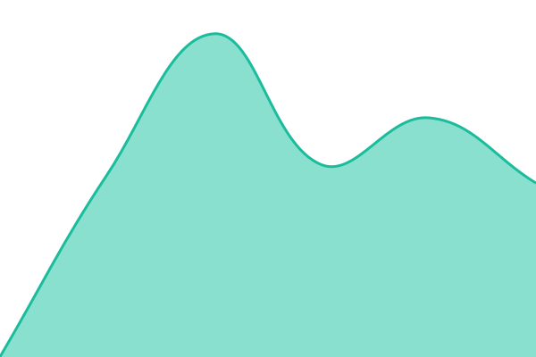
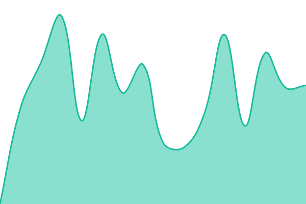
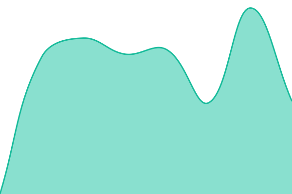
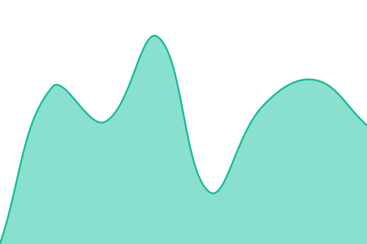
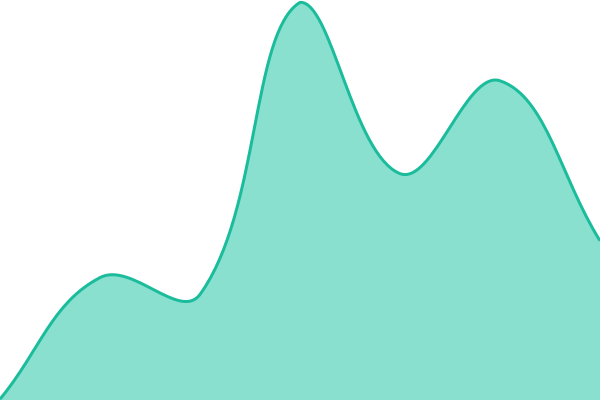

   
  <h1>PDSSP Platform Status</h1>
  
Real-time uptime monitoring for STAC Planet services — powered by <a href="https://github.com/upptime/upptime">Upptime</a>

---

This repository contains the open-source uptime monitor and status page for [Pôle de Données et Services Surfaces Planétaires](https://pdssp.github.io), powered by [Upptime](https://github.com/upptime/upptime).

## 🟢 Services

<!--start: status pages-->
<!-- This summary is generated by Upptime (https://github.com/upptime/upptime) -->
<!-- Do not edit this manually, your changes will be overwritten -->
<!-- prettier-ignore -->
| URL | Status | History | Response Time | Uptime |
| --- | ------ | ------- | ------------- | ------ |
|  [STAC Planet](https://stacplanet.pdssp.eu) | 🟩 Up | [stac-planet.yml](https://github.com/pdssp/platform-monitoring/commits/HEAD/history/stac-planet.yml) | 

 578ms
     
 | 

<a href="https://pdssp.github.io/platform-monitoring/history/stac-planet">96.66%</a>
    

|  [STAC Catalog](https://stac.stacplanet.pdssp.eu) | 🟩 Up | [stac-catalog.yml](https://github.com/pdssp/platform-monitoring/commits/HEAD/history/stac-catalog.yml) | 

 609ms
     
 | 

<a href="https://pdssp.github.io/platform-monitoring/history/stac-catalog">96.76%</a>
    

|  [Antflow](https://antflow.stacplanet.pdssp.eu) | 🟩 Up | [antflow.yml](https://github.com/pdssp/platform-monitoring/commits/HEAD/history/antflow.yml) | 

 585ms
     
 | 

<a href="https://pdssp.github.io/platform-monitoring/history/antflow">96.85%</a>
    

|  [Antflow STAC Browser](https://stac-browser.antflow.stacplanet.pdssp.eu) | 🟩 Up | [antflow-stac-browser.yml](https://github.com/pdssp/platform-monitoring/commits/HEAD/history/antflow-stac-browser.yml) | 

 581ms
     
 | 

<a href="https://pdssp.github.io/platform-monitoring/history/antflow-stac-browser">96.95%</a>
    

|  [ODE STAC](https://odestac.stacplanet.pdssp.eu) | 🟩 Up | [ode-stac.yml](https://github.com/pdssp/platform-monitoring/commits/HEAD/history/ode-stac.yml) | 

 780ms
     
 | 

<a href="https://pdssp.github.io/platform-monitoring/history/ode-stac">97.05%</a>
    

|  [Mapproxy](https://mapproxy.stacplanet.pdssp.eu) | 🟩 Up | [mapproxy.yml](https://github.com/pdssp/platform-monitoring/commits/HEAD/history/mapproxy.yml) | 

 517ms
     
 | 

<a href="https://pdssp.github.io/platform-monitoring/history/mapproxy">97.14%</a>
    

|  [Authentication](https://auth.stacplanet.pdssp.eu) | 🟩 Up | [authentication.yml](https://github.com/pdssp/platform-monitoring/commits/HEAD/history/authentication.yml) | 

 1349ms
     
 | 

<a href="https://pdssp.github.io/platform-monitoring/history/authentication">97.24%</a>
    

|  [Monitoring dashboards](https://grafana.stacplanet.pdssp.eu) | 🟩 Up | [monitoring-dashboards.yml](https://github.com/pdssp/platform-monitoring/commits/HEAD/history/monitoring-dashboards.yml) | 

 1148ms
     
 | 

<a href="https://pdssp.github.io/platform-monitoring/history/monitoring-dashboards">97.33%</a>
    

|  [Rosetta 3D Web site](https://rosetta-3dcomet.cnes.fr) | 🟩 Up | [rosetta-3-d-web-site.yml](https://github.com/pdssp/platform-monitoring/commits/HEAD/history/rosetta-3-d-web-site.yml) | 

 1178ms
     
 | 

<a href="https://pdssp.github.io/platform-monitoring/history/rosetta-3-d-web-site">99.37%</a>
    

|  [XYZ Rosetta](https://xyz-rosetta.psl.pdssp.eu) | 🟩 Up | [xyz-rosetta.yml](https://github.com/pdssp/platform-monitoring/commits/HEAD/history/xyz-rosetta.yml) | 

 454ms
     
 | 

<a href="https://pdssp.github.io/platform-monitoring/history/xyz-rosetta">97.43%</a>
    

<!--end: status pages-->

📈 **[View detailed response time graphs →](https://pdssp.github.io/monitoring-dashboard/dashboard.html)**

---

## 📋 CI Workflows

With [Upptime](https://upptime.js.org), you can get your own unlimited and free uptime monitor and status page, powered entirely by a GitHub repository. We use [Issues](https://github.com/pdssp/platform-monitoring/issues) as incident reports, [Actions](https://github.com/pdssp/platform-monitoring/actions) as uptime monitors, and [Pages](https://pdssp.github.io/platform-monitoring) for the status page.

---

## ℹ️ How it works

This repository uses [Upptime](https://upptime.js.org) to monitor services with zero infrastructure:

- **GitHub Actions** checks each endpoint every 5 minutes
- **GitHub Issues** are opened automatically on downtime
- **GitHub Pages** hosts the public status page at [pdssp.github.io/platform-monitoring](https://pdssp.github.io/platform-monitoring)
- **Response time dashboard** with interactive graphs at [pdssp.github.io/monitoring-dashboard](https://pdssp.github.io/monitoring-dashboard/dashboard.html)

---

## 📄 License

- Powered by: [Upptime](https://github.com/upptime/upptime)
- Code: [MIT](./LICENSE) © [Anand Chowdhary](https://anandchowdhary.com)
- Data in `./history`: [Open Database License](https://opendatacommons.org/licenses/odbl/1-0/)
